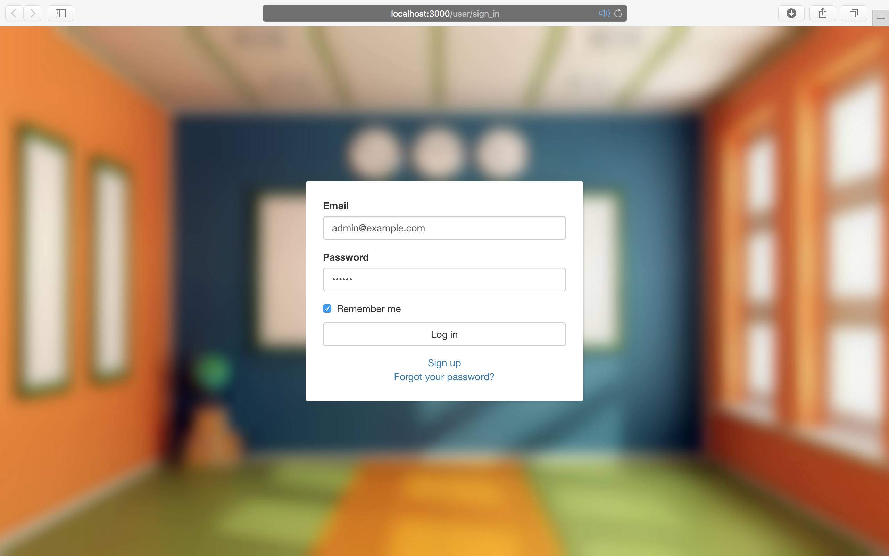
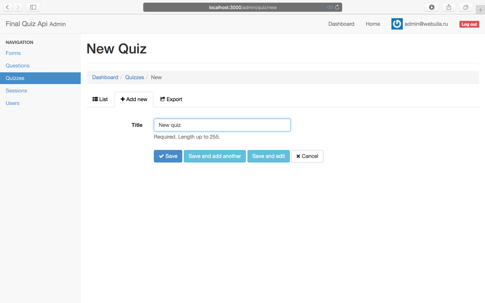
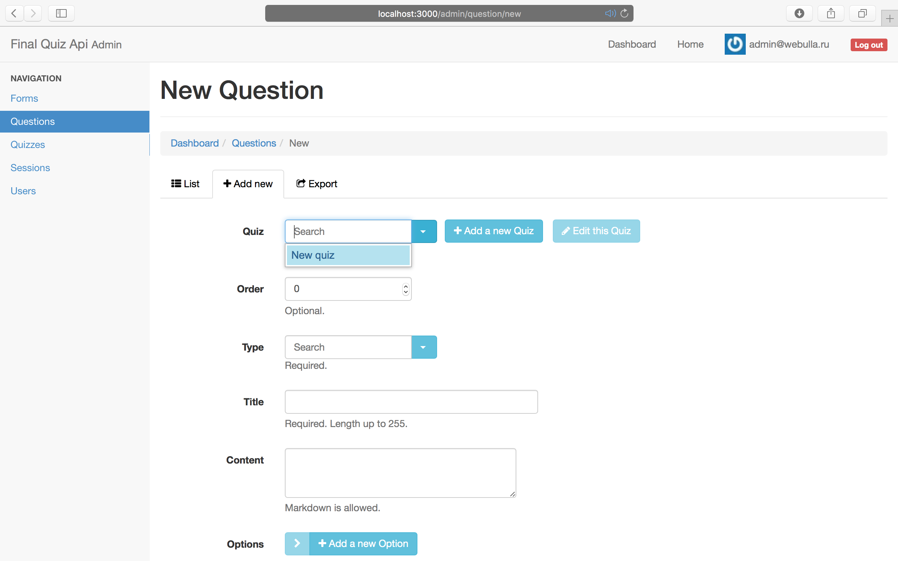

## Quick start guide

#### 1. Clone the repo.
```bash
mkdir exam
cd exam
git clone https://github.com/gustarus/exam-server.git
cd server
```

#### 2. Launch mongo database (via brew).
```bash
brew services start mongodb
```

Or install mongodb.
```bash
brew install mongodb
```

#### 3. Create mongo database.
```bash
mongo
# MongoDB shell version: 3.2.10
# connecting to: test
 
use exam
# switched to db exam
 
exit
# bye
```

#### 4. Install gems.
```bash
bundle
```

#### 5. Create admin user with rake task.
```bash
# for example
rake service:register[admin@example.com,qwerty,true]
 
# command template
# rake service:register[{user email},{user password},{user is admin (true|false)}]
```

#### 6. Generate three random quizes via fixtures task.
```bash
rake fixtures:generate_quizes
```

#### 7. Launch the server.
```bash
rails s
  
# or you can launch the server in production mode
unicorn -c config/unicorn.rb -p 3000 -E production
```

#### 8. Open the project.
```bash
open http://localhost:3000
```

#### 9. Login to the system.



#### 10. Create a poll or edit already existed poll.
Go to https://localhost:3000 and customize already existed poll or create an existed poll (which was generated by fixtures).




Add new questions to the quiz.




#### 11. Launch the client and share the link the between studends.
Go to https://github.com/gustarus/exam-client.git to see details.

#### 13. Wait for the students and start the quiz.
**To be done.**
